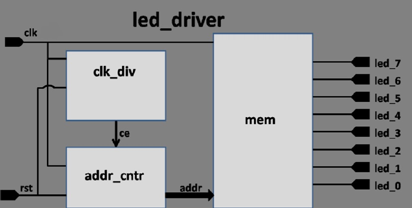

# LED_Driver

The following design is implemented on Arty Z7-20 board.
I/O constraints for the board is also attached in the repository.

The mem module is initially an 4-bit wide ROM with 8 words. This submodule will be created using a two-dimensional array of a Verilog reg data type and procedural assignment statements.
